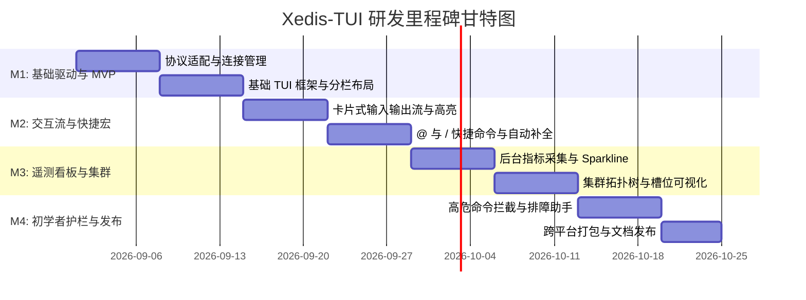

# Xedis-TUI 项目研发计划与架构设计方案

> **项目名称**：`Xedis-TUI`  
> **定位**：面向开发者与初学者的现代化 Redis / 兼容协议终端交互式管理与排障工具  
> **设计对标**：Codex CLI、Claude Code、Antigravity CLI、Lazygit

---

## 一、 开发语言与技术栈选型评估

TUI 工具对于**跨平台无依赖单二进制分发**、**极低内存占用**、**高帧率流畅渲染**以及**高并发异步 I/O (处理 Redis 管道与监控流)** 有严苛要求。

### 1. 语言评估对比 (Rust vs Go)

| 维度 | 方案 A: **Rust (推荐首选)** 🦀 | 方案 B: **Go (备选)** 🐹 |
| :--- | :--- | :--- |
| **TUI 生态** | **`ratatui` + `crossterm`** (目前行业最强 TUI 框架，性能极高，支持多层视口与平滑渲染) | **`bubbletea` + `lipgloss`** (Elm 架构，开发体验极佳，组件丰富) |
| **Redis 驱动** | `redis-rs` (支持 Tokio 异步、Cluster 拓扑自动重定向、PubSub、Sentinel) | `go-redis/v9` (生态成熟，对 Cluster 与集群分片支持完善) |
| **系统资源开销** | 内存占用极低 (< 15MB)，冷启动 < 10ms，零 GC 停顿 | 内存占用稍大 (~30MB)，冷启动快，存在极轻微 GC |
| **高亮与解析** | `syntect` (代码高亮), `serde_json` (JSON 表格格式化) | `chroma` (语法高亮), `tidwall/gjson` |
| **异步并发模型** | `tokio` (高性能 Epoll/Kqueue 异步运行时) | `goroutine` + `channel` (并发原生支持) |

> 🌟 **结论与推荐**：
> - **首选技术栈**：**Rust + `ratatui` + `crossterm` + `tokio` + `redis-rs`**。
> - **原因**：`ratatui` 在复杂分栏、弹窗浮层（Modal Overlays）、局部刷新、Sparkline 图表渲染方面的控制力远超其他语言，且编译出的单一二进制文件在 Linux、macOS、Windows 上无需任何运行时环境即可执行。

---

## 二、 整体系统架构设计 (System Architecture)

Xedis-TUI 采用 **事件驱动 (Event-Driven) + 单向数据流 (Unidirectional Data Flow)** 的清晰分层架构：

```
+---------------------------------------------------------------------------------------+
|                                    UI Layer (Ratatui)                                 |
|  +---------------------------+  +--------------------------------------------------+  |
|  |  Left: CommandStreamView  |  |  Right: TelemetryView / ClusterView / SlowlogView|  |
|  +---------------------------+  +--------------------------------------------------+  |
|  |  Prompt & Autocomplete    |  |  Top: InstanceBar  |  Bottom: ShortcutBar        |  |
|  +---------------------------+  +--------------------------------------------------+  |
+------------------------------------------+--------------------------------------------+
                                           | (User Actions / State Updates)
                                           v
+---------------------------------------------------------------------------------------+
|                                Application State (App Model)                          |
|  - LayoutState (Balanced / Focus / Monitor / Zen 预设)                                 |
|  - StreamState (Message Cards, Scroll Offset, Syntax Highlighting)                    |
|  - ClusterTopologyState (Nodes, Slots Range, Health Map, Master-Replica Trees)       |
|  - TelemetryState (Memory Gauge, QPS History Sparklines, CPU, Hit Rate)               |
+------------------------------------------+--------------------------------------------+
                                           | (Events & Async Dispatch)
                                           v
+---------------------------------------------------------------------------------------+
|                             Core Business Engine (异步核心层)                          |
|  +------------------------+  +-----------------------+  +---------------------------+ |
|  | Safety Guard (拦截器)  |  | Command Router / Parser | | Macro Engine (/scan, etc.)| |
|  +------------------------+  +-----------------------+  +---------------------------+ |
|  | Background Telemetry   |  | Topology Discoverer   |  | History & Bookmark Store  | |
|  +------------------------+  +-----------------------+  +---------------------------+ |
+------------------------------------------+--------------------------------------------+
                                           | (Async RESP Commands)
                                           v
+---------------------------------------------------------------------------------------+
|                      Protocol & Driver Layer (X-edis Adapter)                         |
|  +---------------------------------------------------------------------------------+  |
|  |  RESP2 / RESP3 协议适配器 (兼容 Redis 6/7+, Dragonfly, Valkey, KeyDB)          |  |
|  +---------------------------------------------------------------------------------+  |
|  |  Standalone Client  |  Cluster Client (Slot Routing)  |  Sentinel Client        |  |
+---------------------------------------------------------------------------------------+
                                           |
                                     (TCP / TLS / Unix Domain Socket)
                                           v
                             [ Redis / Dragonfly / Valkey Cluster ]
```

---

## 三、 核心子系统详细设计

### 1. 语法与快捷宏引擎 (Macro & Router Engine)
- **命令解析器**：输入文本经 Tokenizer 分词，提取目标节点前缀（如 `@node-1`）、指令名与参数。
- **`/` 快捷宏转换系统**：
  - `/scan [pattern] [count]` $\rightarrow$ 自动在后台循环执行 `SCAN` 游标拉取，合并为轻量结果，避免客户端卡死。
  - `/bigkeys` $\rightarrow$ 分批发送 `MEMORY USAGE` 或 `TYPE/STRLEN/HLEN` 进行统计排序。
  - `/slowlog` $\rightarrow$ 解析 `SLOWLOG GET` 并附带人类易读的优化建议字典。
- **`@` 节点路由器**：
  - 若输入包含 `@<node_id|ip:port>`，客户端绕过 Slot 计算直接向指定节点建立连接并派发命令。

### 2. 初学者高危安全拦截层 (Safety Guard)
- **危险命令规则库**：
  - Level 3 (绝对阻断/高危)：`FLUSHALL`、`FLUSHDB`、`SHUTDOWN`、`KEYS *`、`CONFIG REWRITE`、`DEBUG SEGFAULT`。
  - Level 2 (告警提示)：无 Limit 的遍历、未设置过期时间的批量写操作。
- **拦截流程**：
  1. 拦截器捕获指令，中断直接执行流程；
  2. 挂起主输入，弹出确认 Modal；
  3. 渲染危险原因说明与安全替代命令；
  4. 用户按下 `Esc` 取消，或输入 `yes` / 按回车二次确认后才放行。

### 3. 多协议与兼容层 (X-Adapter)
- 适配标准 **RESP2 / RESP3**。
- 支持 **Redis 6.x/7.x**、**Dragonfly**（多线程高吞吐）、**Valkey** 以及 **KeyDB**。
- 自动探测服务端版本与特性（如 `INFO SERVER` 字段适配），遇到不支持的命令优雅降级。

### 4. 实时遥测与集群拓扑采集器 (Telemetry Poller)
- 独立 Tokio Background Task：
  - 每隔 `1s`（可配置）发送 `INFO stats`、`INFO memory`、`INFO cpu`，计算差值得到实时 QPS 与 CPU 走势。
  - 每隔 `5s` 执行 `CLUSTER NODES` 或 `CLUSTER SLOTS`，维护当前槽位映射与 Master/Replica 关系树。

---

## 四、 项目研发里程碑规划 (Milestones & Roadmap)

整个研发周期划分为 4 个主要里程碑（预计总周期约 6~8 周）：



### 阶段一 (M1, 约 2 周)：核心通信层与基础 TUI 骨架
- [x] 完成项目工程初始化与依赖选型（Rust + Ratatui + Tokio + Redis-rs）。
- [ ] 实现连接管理器：支持单机、Sentinel、Cluster、TLS 加密连接与密码认证。
- [ ] 搭建 4 种分栏预设（平衡 58%、沉浸 75%、监控 35%、纯流 100%）与 `F5` 快捷切换。
- [ ] 实现单机模式下的原生 Redis 命令执行与 Raw 输出。

### 阶段二 (M2, 约 2 周)：现代化交互流与快捷指令系统
- [x] 实现类 AI CLI 的卡片式 Message Stream（支持执行耗时标记、时间戳）。
- [x] 实现 Hash 表格化渲染、List/Set 树状与 JSON 高亮渲染。
- [x] 实现输入框智能补全浮层（Dropdown Popover）。
- [x] 实现 `@` 选节点与 `/scan`、`/bigkeys`、`/slowlog` 快捷宏解析与执行。

### 阶段三 (M3, 约 1.5 周)：多维遥测监控与集群拓扑
- [x] 实现后台轻量级 Telemetry Poller（采样 QPS、CPU、Used Memory、碎片率，支持动态 `/interval` 与 `/settings` 配置）。
- [x] 研发终端 Sparkline 实时走势折线图与内存多段水位条（圆弧框线卡片 + 状态色阶染）。
- [x] 实现集群分片拓扑树（Master-Replica 关联、0~16383 槽位区间分配与单机主从降级）。
- [x] 实现 SLOWLOG 实时监听与大 Key 告警列表展示（智能排障调优建议）。

### 阶段四 (M4, 约 1.5 周)：新手护栏、调优与多平台发布
- [ ] 实现 Safety Guard 高危命令拦截阻断弹窗与新人新手排障知识库（`F1` 帮助）。
- [ ] 优化大数据量查询下的终端滚动流畅度与内存占用（虚拟滚动列表）。
- [ ] 编写全面的单元测试与 Redis 集群 Mock 测试。
- [ ] CI/CD 跨平台构建发布（Homebrew、Cargo install、Github Releases 二进制）。

---

## 五、 推荐目录工程结构 (Rust Workspace)

```
xedis/
├── Cargo.toml
├── src/
│   ├── main.rs               # 程序入口、CLI 参数解析 (clap)
│   ├── app.rs                # 全局 App 状态机、事件循环与按键路由
│   ├── config.rs             # 配置文件读写 (~/.config/xedis/config.toml)
│   ├── ui/                   # TUI 视图层 (Ratatui Widgets)
│   │   ├── mod.rs
│   │   ├── layout.rs         # 4 种分栏预设比例与自适应计算
│   │   ├── stream_view.rs    # 左侧卡片流渲染 (Table, JSON, Tree)
│   │   ├── telemetry_view.rs # 右侧内存条、QPS Sparkline 仪表盘
│   │   ├── cluster_view.rs   # 右侧集群拓扑树形图
│   │   ├── slowlog_view.rs   # 右侧慢查询与排障视图
│   │   └── popups/           # 浮层 (补全弹窗、Safety Guard 拦截弹窗)
│   ├── core/                 # 业务核心层
│   │   ├── router.rs         # 指令路由与 @/@ 宏分发
│   │   ├── guard.rs          # 高危命令拦截器与风险库
│   │   ├── telemetry.rs      # 异步后台指标采集 Task
│   │   └── history.rs        # 历史命令持久化
│   └── backend/              # Redis / X-edis 底层驱动
│       ├── mod.rs
│       ├── client.rs         # 单机 / 集群通用 Client 抽象
│       ├── cluster_info.rs   # 槽位发现与拓扑状态解析
│       └── resp_formatter.rs # 返回值类型推导与格式化
└── tests/                    # 集成与 Mock 测试
```
